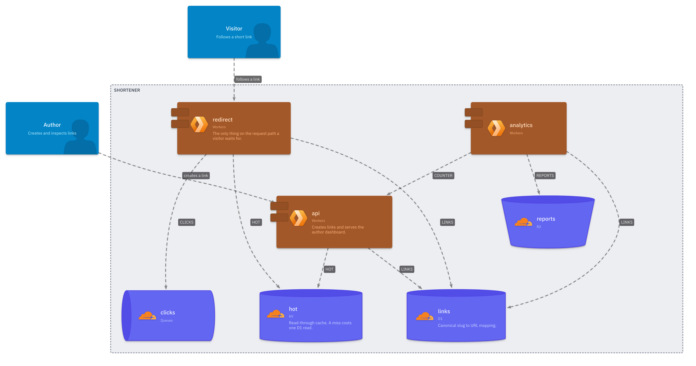
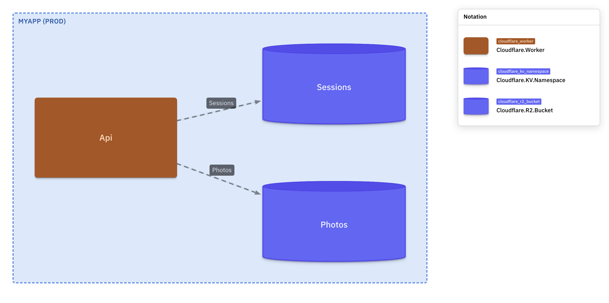

# alchemy-likec4

[alchemy-likec4](https://github.com/0x0f0f0f/alchemy-likec4) Automatically generate [LikeC4](https://likec4.dev) specs and diagrams from [alchemy](https://alchemy.run) stacks!



> [!WARNING]
> **Alchemy is in beta and under active development.** Resource
> declarations will change between version, Every release of `alchemy-likec4`
> targets **one alchemy 2 beta only** and the version says which: `0.77.x` is
> built against `alchemy@2.0.0-beta.77`. Match them and regenerate your diagrams after every
> alchemy bump!

**Why?** You have written your infrastructure with
[Alchemy](https://alchemy.run)
([Github](https://github.com/alchemy-run/alchemy)), and you need a good way to
document your software architecture. This package lets you auto-generate
[LikeC4](https://github.com/likec4/likec4) diagrams, specifications and
deployment models from your alchemy stack,

**What is alchemy?** [Alchemy](https://alchemy.run) is infrastructure as code
written in pure [Effect](https://effect.website). Your cloud is one TypeScript
program: the resources, the code that runs on them, and the wires between them,
all in a single `yield*` chain.

**What is LikeC4?** LikeC4 is a modeling language for describing software
architecture and tools to generate diagrams from the model.

From this stack (`examples/basic/alchemy.run.ts`):

```ts
import * as Alchemy from "alchemy";
import * as Cloudflare from "alchemy/Cloudflare";
import * as Effect from "effect/Effect";

export default Alchemy.Stack(
  "MyApp",
  { providers: Cloudflare.providers(), state: Alchemy.inMemoryState() },
  Effect.gen(function* () {
    /** Original uploads, never served directly. */
    const Photos = yield* Cloudflare.R2.Bucket("Photos");

    /** Signed-in sessions, read on every request. */
    const Sessions = yield* Cloudflare.KV.Namespace("Sessions");

    /** The only public entrypoint. Reads photos, writes sessions. */
    const api = yield* Cloudflare.Worker("Api", {
      main: "./src/worker.ts",
      env: { Photos, Sessions },
    });

    /** The marketing site and dashboard, server-rendered at the edge. */
    const site = yield* Cloudflare.Website.Astro("Site", {
      env: { API: api },
    });

    return { url: site.url };
  }),
);
```

run this, with a LikeC4 project at `examples/basic/docs/architecture`:

```bash
alchemy-likec4 generate --project examples/basic/docs/architecture --entrypoint examples/basic/alchemy.run.ts --stage prod
likec4 export png examples/basic/docs/architecture
```

That project contains one hand-written file, `likec4.config.json`, and nothing else:

```json
{ "name": "basic" }
```

and you get this, without deploying anything:



Two things in that picture nobody wrote. `SiteSession` is a KV namespace alchemy provisions on its
own to back Astro's session API, so the diagram shows infrastructure you did not know you had. And
the Astro site renders as a Worker, because that is what it is once deployed.

## Supports

Everything that [Alchemy](https://github.com/alchemy-run/alchemy)

- **Clouds**: Cloudflare, AWS, Fly, Hetzner, Railway.
- **Data**: D1, R2, KV, Durable Objects, Queues, Hyperdrive, plus PlanetScale, Neon, Prisma, Drizzle, plain SQL.
- **Frontends**: Vite, Astro, Next.js, Nuxt, SvelteKit, TanStack Start, React Router v7, SolidStart, Waku, static sites.
- **Ops**: GitHub, Git, Docker, Kubernetes, Axiom, BetterAuth, a raw Command resource for everything else.
- **CLI**: deploy, plan, destroy, drift, dev with hot reload, logs, state, nuke.

---

## How to

### Add a LikeC4 project to your alchemy repo

LikeC4 treats any directory holding a `likec4.config.json` as a project, and every `.c4` under
it, recursively, as part of it. `alchemy-likec4` writes only into such a directory, under
`alchemy/`. Put it anywhere; `docs/architecture` is a good default:

```
docs/architecture/
├─ likec4.config.json     # name, optional styles — this file makes it a project
├─ specification.c4       # your own element kinds and tags — actors, systems
├─ mine.c4                # your actors, your relationships, your `extend` blocks
├─ views.c4               # the views you care about
└─ alchemy/               # GENERATED — every alchemy-likec4 run rewrites it
   ├─ MyApp.model.gen.c4  # the kinds your stack uses, and your stack as a model
   ├─ MyApp.prod.gen.c4   # each resource as a deployed instance, one file per stage
   └─ MyApp.views.gen.c4  # a landscape view, and one per stage
```

Every file outside `alchemy/` is optional. The `examples/basic` project in this repo contains
nothing but the config file, and still renders the diagram above.

The minimum is the config file:

```bash
mkdir -p docs/architecture && echo '{ "name": "my-app" }' > docs/architecture/likec4.config.json
```

On LikeC4's side:

- [Project configuration](https://likec4.dev/dsl/config/) — `likec4.config.json`, styles, `exclude`
- [Multiple projects](https://likec4.dev/dsl/config/multi-projects) — one per package in a monorepo, `import` between them
- [CLI](https://likec4.dev/tooling/cli) — `likec4 start`, `build`, `export png`, `validate`
- [Editors](https://likec4.dev/tooling/editors/) — the VS Code extension
- [Validate your model](https://likec4.dev/guides/validate-your-model) — Vitest rules against the model
- [likec4/template](https://github.com/likec4/template) — a starter repo

## Generate

Runs on Node 20+ or Bun. npm, pnpm, yarn and bun all work.

```bash
npm install -D alchemy-likec4
npx alchemy-likec4 generate --project docs/architecture --stage prod
```

Bun is the recommended runtime, because alchemy itself is bun-first:

```bash
bun add -d alchemy-likec4
bunx alchemy-likec4 generate --project docs/architecture --stage prod
```

One command writes three files into `docs/architecture/alchemy/`:

| File                     | Contents                                                                                                  |
| ------------------------ | --------------------------------------------------------------------------------------------------------- |
| `<Stack>.model.gen.c4`   | the element kinds your stack uses, styled and iconed, and one element per resource with its relationships |
| `<Stack>.<stage>.gen.c4` | each resource as a deployed instance, one file per stage                                                  |
| `<Stack>.views.gen.c4`   | a landscape view and one deployment view per stage                                                        |

Run it again with `--stage staging` to add a stage. Nothing else is touched, and the views file
picks up every stage it finds. `--entrypoint path/to/alchemy.run.ts` reads another stack.
`--all-kinds` declares every resource kind alchemy ships instead of only the ones you use, which
is useful for browsing and noisy for everything else.

`--project` is required, and anything that is not a LikeC4 project is refused. To create one, make
the directory and put a config file in it:

```bash
mkdir -p docs/architecture && echo '{ "name": "my-app" }' > docs/architecture/likec4.config.json
```

Commit `alchemy/`: the diff on an alchemy bump is the review.

### What is derived, and from what

Nothing in the list below is typed by hand, in this package or in your repo.

| On the diagram                            | Comes from                                                                |
| ----------------------------------------- | ------------------------------------------------------------------------- |
| element kind, e.g. `cloudflare_r2_bucket` | the resource's canonical id, `R2.Bucket.Type`                             |
| shape                                     | the resource name: a `Bucket` is a bucket, a `Queue` is a queue           |
| colour                                    | alchemy's `@category`, so one product family reads as one group           |
| icon                                      | the vendor's own icon set in `@likec4/icons`, matched on the service name |
| `technology`, e.g. `R2`                   | alchemy's `@product`                                                      |
| description                               | the JSDoc you wrote above the resource in `alchemy.run.ts`                |
| relationships                             | the `env` bindings, typed by binding kind                                 |
| the prod/staging mapping                  | `instanceOf`, from the compiled stack                                     |

### While alchemy is in beta, pin the effect graph

This is alchemy's constraint, not ours, and it bites `npm install alchemy` on its own. Effect 4 is
a release candidate with breaking changes between builds, and alchemy's version ranges are open,
so a fresh npm install resolves a newer effect than the alchemy beta was built against. The
symptom is `TypeError: Config.string is not a function` on the first import.

Add this to your `package.json` and the whole tree lands on one version:

```json
{
  "overrides": {
    "effect": "4.0.0-rc.112",
    "@effect/platform-node": "4.0.0-rc.112",
    "@effect/platform-bun": "4.0.0-rc.112",
    "@effect/platform-node-shared": "4.0.0-rc.112"
  }
}
```

Use `resolutions` instead of `overrides` on yarn, and `pnpm.overrides` on pnpm. Any direct
dependency on one of those packages has to be the exact same version, or npm refuses the override.
Bun users need this less often, because `bun.lock` already holds one resolved version.

From a script:

```ts
import { writeFile } from "node:fs/promises";
import { openStack, buildDeployment } from "alchemy-likec4";

await writeFile(
  "docs/architecture/alchemy/MyApp.prod.gen.c4",
  buildDeployment(await openStack({ stage: "prod" })),
);
```

## What you write

Your own file adds the things alchemy cannot know: who uses the system, what is on the hot path,
and which views matter.

```likec4
model {
  visitor = actor 'Visitor'
  visitor -> shortener.redirect 'follows a link'

  extend shortener.redirect {
    #hot-path
    metadata { p99 '8ms' }
    link https://example.com/runbook 'Runbook'
  }
}
```

`extend` adds tags, metadata, links and relationships to a generated element, from your file, for
as long as the element exists. It cannot set a description, a title or a style, so prose goes in
the JSDoc above the resource and restyling goes in a view.

Relationships are generated into the `model`, not the `deployment`. That matters: LikeC4 inherits
deployment relationships from the logical model and never the other way, so one declaration draws
the edge in both your landscape view and every stage's deployment view. Declaring a binding in
both places renders it twice, because the model-derived edge joins the instances while a
deployment relation joins the nodes.

Comparing what you intended against what alchemy wired is a test, not a second set of arrows:

```ts
import { matchers } from "alchemy-likec4/vitest";
expect.extend(matchers);
expect(model).toConverge(graph);
```

It reports four things: a resource with no instance, an instance whose resource is gone, a binding
the stack wires that your model does not relate, and a relationship your model asserts that the
stack does not back.

## Examples

- [`examples/basic`](examples/basic) — one Worker, one bucket, one KV namespace. Its LikeC4 project
  is a single file, `likec4.config.json`, and everything in the second screenshot comes from the
  stack.
- [`examples/link-shortener`](examples/link-shortener) — two stages, two actors, eight bindings.
  The first screenshot is its `index` view. Hand-written: two actors, four `extend` blocks, a
  cross-stage restore edge, and five views including a sequence diagram.

`bun run example` in this repo opens both in LikeC4's UI. `bun run example:png` regenerates both
screenshots.

## How it works

### The specification and the model

Every alchemy resource carries a canonical id (`R2.Bucket.Type === "Cloudflare.R2.Bucket"`), and
nothing else in the namespace does, so that is both the predicate and the identity. Each becomes an
`element` kind, flattened to a legal identifier with the provider kept: `cloudflare_r2_bucket`.
Only the kinds your stack uses are declared.

Styling is derived from two different sources on purpose. Shape comes from the resource name and
colour from alchemy's `@category`, because `Storage & Databases` holds buckets, databases and
queues: the category alone would draw a queue as a cylinder, and the name alone would colour a
bucket the same whichever product family it belongs to. Icons are looked up in the vendor's own set
by service name, so `AWS.DynamoDB.Table` finds `aws:dynamo-db` with no table to maintain.

### The deployment model

`alchemy.run.ts` is imported and its body run under placeholder services, so every
`yield* Cloudflare.Worker(...)` is a registry insert. Resources keep symbolic props;
dependencies are recovered by walking them: a prop holding another resource is an edge, and a
Worker's `env` bindings give each edge its kind.

```likec4
model {
  shortener = alchemy_stack 'Shortener' {
    api = cloudflare_worker { … }
    links = cloudflare_d1_database { … }
  }
  shortener.api -[d1_binding]-> shortener.links 'LINKS'
}

deployment {
  shortener_prod = alchemy_stack 'Shortener (prod)' {
    instanceOf shortener.api { metadata { name 'shortener-api' } }
    instanceOf shortener.links
  }
}
```

The deployment carries no relationships. It does not need to.

## Known limits

- Physical identifiers (bucket ids, worker URLs) exist only after a deploy; the compiled stack
  carries names, not ids.
- Only Cloudflare carries `@category` and binding kinds, so other providers emit untagged kinds
  and no relationship kinds.
- `DurableObject`, `Email.SendEmail` and `Website.Astro` are factory functions with no `.Type`, so
  they are not kinds. An Astro site _is_ a `cloudflare_worker` once deployed.
- Deployment views cannot style by tag or kind (likec4 1.59.3). Style by node reference. Model
  views can style by tag.
- Only Cloudflare carries `@category` and `@product`, so other providers get shapes from the
  resource name, no colour grouping and no technology label.
- Cloudflare has four icons in the bundled sets and none per service, so its resources share a
  brand mark and are told apart by shape and colour. AWS, GCP and Azure get per-service icons.
- `extend` cannot set a description, title, style or icon on a generated element. Descriptions come
  from JSDoc in your stack; restyling goes in a view.
- Alchemy is a beta with no schema guarantee. Every derived list is snapshot-tested so a bump that
  changes shape fails in review instead of silently emitting less.
